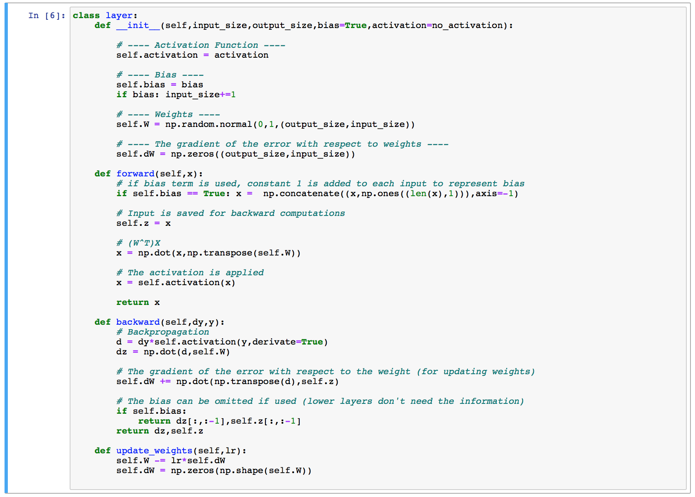

# NNfrom0

This is old implementation. Its very simple but still fun little notebook that demonstrates neural networks in very fundamental level.

The repository provides a jupyter notebook that demonstrates how neural networks can be implemented using linear algebra and numpy library.

